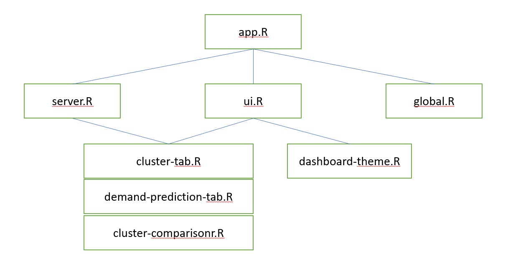

# crm-board-example
A dashboard visualizing customer behavior using R shiny.

> Warning: 
> this was tested only on Ubuntu 16.04. Probably it might work on Mac OS, but not on Windows.

## Requirements

* R 3.3+
* Shiny server

## Run (in local)

Run `scripts/deploy.sh` and you could access through `localhost/sc-demo`

## Development

### Source Diagram

## Remark

Data is a randomly generated data because original data cannot be opened to the public by NDA. `utils/get-random-data.R` generates different random data everytime you run the shiny app.

## License

MIT License